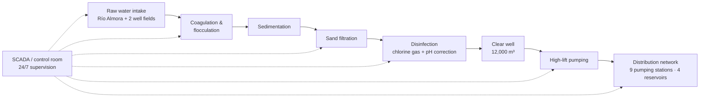

# Client Brief — Aguas de Valdenor, S.A. (AVSA)

> **⚠️ Fictional scenario.** Aguas de Valdenor S.A., the municipality of Valdenor, and every person, facility, asset, figure, and event described in this repository are **entirely fictional**. This project was created to demonstrate an OT/ICS security assessment capability using only public frameworks and standards. It contains no client data, no proprietary material, and no confidential work artifacts.

---

## 1. Organization overview

| Attribute | Detail |
|---|---|
| **Organization** | Aguas de Valdenor, S.A. (AVSA) |
| **Sector** | Drinking water production and distribution (critical infrastructure) |
| **Ownership** | 100% municipally owned (Ayuntamiento de Valdenor, northern Spain) |
| **Population served** | ~152,000 residents / 61,400 service connections |
| **Distribution network** | ~690 km of mains, 9 pumping stations, 4 elevated reservoirs |
| **Workforce** | 187 employees (34 plant operations on 24/7 shifts, 6 automation/OT, 8 IT) |
| **Annual turnover** | ~€29M |
| **Primary facility** | ETAP Río Almora — drinking water treatment plant, design capacity 72,000 m³/day (avg. production ~38,500 m³/day) |
| **Commissioned** | 1998; SCADA platform migrated 2016; remote telemetry upgraded to cellular in 2021 |

AVSA operates the full drinking-water lifecycle for the municipality of Valdenor: raw water abstraction from the Río Almora and two well fields, treatment at the ETAP Río Almora plant, and pressurized distribution across the municipal network. A separate wastewater plant (EDAR) exists under a different operating contract and is **out of scope** for this assessment.

---

## 2. The treatment process

The plant is organized into six **process areas**, which later serve as the basis for zone partitioning in the risk assessment:

| ID | Process area | Function | Key control equipment |
|---|---|---|---|
| PA-1 | Raw water intake | River intake, well field pumps, screening | 3 PLCs |
| PA-2 | Coagulation & flocculation | Coagulant (PAC) dosing, mixing | 4 PLCs |
| PA-3 | Filtration | Sand filter battery, backwash sequencing | 6 PLCs |
| PA-4 | Disinfection & dosing | Chlorine gas dosing (with scrubber), pH correction | 4 PLCs |
| PA-5 | Clear well & high-lift | Storage level control, high-lift pump trains | 4 PLCs |
| PA-6 | Distribution telemetry | 9 remote pumping stations, 4 reservoirs | 13 RTU/PLC units |

Chlorine gas handling in PA-4 is the plant's most safety-critical process: a dosing failure has direct public-health consequences (under- or over-chlorinated water) and an uncontrolled release is a hazard to plant personnel.

---

## 3. The OT environment at a glance

| Layer | Assets |
|---|---|
| **Field devices (Purdue L0–L1)** | 24 plant PLCs (Siemens SIMATIC S7-1500/S7-1200) with Profinet device-level segments; 13 remote RTU/PLC units at distribution sites |
| **Supervision (L2)** | Redundant SCADA server pair (commercial water-sector SCADA platform); 4 control-room operator workstations; 6 local panel HMIs (2 still running Windows 7) |
| **Site operations (L3)** | 1 process historian; 1 engineering workstation (plant); 1 field engineering laptop |
| **Remote telemetry** | 4G cellular VPN from distribution sites terminating on the plant firewall |
| **Third parties** | SCADA integration and PLC maintenance outsourced to Nortec Automatización S.L. (fictional vendor), with remote maintenance access |

---

## 4. IT environment and IT/OT convergence

Corporate IT (billing, customer service, GIS, email, ERP) runs on a separate corporate LAN managed by the 8-person IT team. There is no dedicated OT security role: the IT Manager holds information-security responsibility part-time, and the automation team manages plant systems operationally.

The IT and OT environments converge at three points: the process historian replicates data to a corporate reporting server; the SCADA integrator (Nortec) maintains remote access for support; and a single IT-managed perimeter firewall separates the corporate LAN from the plant control network. There is currently **no OT DMZ** — a central finding developed in the assessment.

---

## 5. Self-declared security posture (pre-assessment)

In scoping interviews, AVSA management acknowledged that OT security has historically been treated as an extension of plant maintenance rather than a managed program. Known pain points include the absence of an OT-specific incident response plan, an asset inventory maintained as a spreadsheet that was last updated in 2024, and legacy operating systems on some HMI panels that cannot be patched without vendor requalification. The assessment validates and extends this picture using structured methods (IEC 62443-3-2 risk assessment and a C2M2 maturity evaluation).

---

## 6. Regulatory context

As a drinking-water supplier, AVSA falls under **Annex I (drinking water)** of the **NIS2 Directive**. On size alone (187 employees, ~€29M annual turnover) AVSA is a medium-sized enterprise and would default to *important entity* status; however, it has been **designated a critical entity** under the CER Directive — transposed in Spain alongside the national critical-infrastructure framework (Ley PIC 8/2011, in which water is a strategic sector) — which makes it an **essential entity** under NIS2 Article 3(1). Essential-entity status brings binding cybersecurity risk-management measures, incident-reporting obligations, management-body accountability, and proactive (ex-ante) supervision. As a municipally owned company delivering a public service, AVSA additionally falls within the scope of Spain's **Esquema Nacional de Seguridad (ENS)**. Deliverable 7 of this assessment maps these obligations in detail.

---

## 7. Why this assessment — engagement drivers

In **November 2025**, a phishing-delivered ransomware incident encrypted AVSA's corporate billing servers. Plant operations were unaffected, but the incident revealed that the historian's replication link — and the absence of any buffer zone between corporate IT and the plant network — could have carried the compromise into the control environment. Combined with sustained public advisories about threat actors targeting water utilities' internet-exposed control systems, and the compliance deadlines arriving with NIS2 transposition, the board commissioned an independent OT security assessment.

---

## 8. Engagement scope (preview)

**System under Consideration (SuC):** the ETAP Río Almora treatment plant control system (PA-1 through PA-5) and the distribution telemetry network (PA-6), including their connections to corporate IT and third-party remote access.

**Exclusions:** the EDAR wastewater facility (separate operating contract), and corporate IT systems (considered as context and as a threat vector, but not assessed directly).

The full scope definition, zone/conduit partitioning, and methodology are documented in [`02-risk-assessment/`](../02-risk-assessment/).

---

*Fictional scenario — see the disclaimer at the top of this document and in the repository README.*
