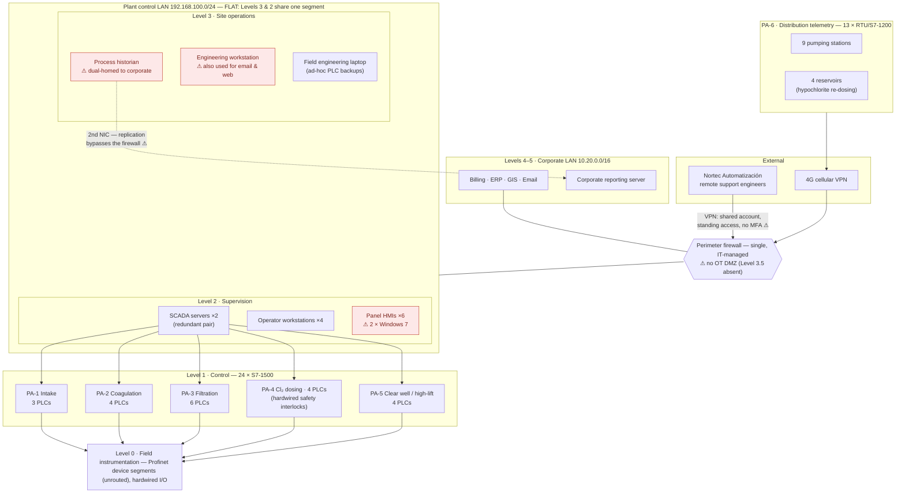

# Reference Architecture — ETAP Río Almora (Current State)

This document maps AVSA's OT environment onto the **Purdue reference model** (per IEC 62443 and NIST SP 800-82r3 usage), documents data flows, IT/OT convergence points, and remote-access paths, and records the **architectural observations** that feed the risk assessment in [`02-risk-assessment/`](../02-risk-assessment/).

> **Scope note:** this is the **current state** as found during fieldwork (July 2026). The target architecture is developed in the remediation roadmap (`03-maturity-assessment/`), driven by the risk assessment — not the other way around.

---

## 1. Why the Purdue Model

The Purdue model (via ISA-95) is the shared vocabulary OT security uses to reason about *where assets sit* and *what should separate them*: Level 0 (physical process) up through Level 5 (enterprise), with a **Level 3.5 OT DMZ** brokering everything that crosses the IT/OT boundary. It is a lens rather than a mandate — modern realities like cellular telemetry (which AVSA has) don't fit the 1990s diagram neatly — but the principle it encodes is timeless: *know your trust boundaries, and broker every flow that crosses them.* IEC 62443 then formalizes this into **zones and conduits**, which the risk assessment develops in Deliverable 2.

## 2. AVSA mapped to Purdue levels

| Level | Reference function | AVSA today | Deviation? |
|---|---|---|---|
| L5/L4 | Enterprise & site business systems | Corporate LAN `10.20.0.0/16`: billing, ERP, GIS, email, reporting server | — |
| **L3.5** | **OT DMZ**: replica historian, jump hosts, patch staging | **Does not exist** | **AO-1** |
| L3 | Site operations | Process historian, engineering workstation, field laptop | Historian is dual-homed (**AO-1**); L3 shares a flat segment with L2 (**AO-2**) |
| L2 | Supervisory control | Redundant SCADA pair, 4 operator workstations, 6 panel HMIs | 2 HMIs on Windows 7 (**AO-4**); same flat segment (**AO-2**) |
| L1 | Basic control | 24 × Siemens S7-1500 across PA-1…PA-5; 13 RTU/S7-1200 at PA-6 remote sites | Remote units reach L2/L3 directly via 4G VPN (**AO-2**) |
| L0 | Physical process | Profinet device segments (unrouted) and hardwired I/O per process area | — |

## 3. Network topology (current state)

A rendered version lives at [`diagrams/avsa-current-architecture.svg`](diagrams/avsa-current-architecture.svg).

## 4. Data flows and IT/OT convergence points

| # | Flow | Path | Purpose | Concern |
|---|---|---|---|---|
| F1 | Historian replication | Historian **2nd NIC** → corporate reporting server | Production/quality reporting to business users | Crosses the IT/OT boundary **outside** the firewall — a corporate compromise has a direct, unbrokered route into the control network (**AO-1**) |
| F2 | Vendor remote maintenance | Nortec engineers → internet VPN → perimeter firewall → plant LAN | SCADA support, PLC logic changes | Shared credential, standing (always-on) access, no MFA, lands on the **flat** control segment (**AO-3**) |
| F3 | Distribution telemetry | PA-6 RTUs → 4G cellular VPN → perimeter firewall → plant LAN | Remote monitoring/control of pumping stations & reservoirs | Terminates **directly inside** the same flat segment as SCADA, historian, and engineering assets (**AO-2**) |
| F4 | Operator control | Operator WS / HMIs ↔ SCADA ↔ PLCs (Profinet/OPC UA) | Normal supervision and control | Expected flow — but every asset above shares one broadcast domain with it |

Convergence points, in one sentence: the environments meet at the **firewall**, at the **historian's second NIC**, and through **two externally originated VPN paths** (vendor and telemetry) that both terminate on the flat control segment.

## 5. Remote-access paths

Three paths exist into the control environment: the **Nortec VPN** (F2), the **cellular telemetry VPN** (F3), and the **field engineering laptop**, which physically moves between the plant network, remote sites, and (per interviews) the engineer's home network. The laptop is easy to overlook because it isn't a "connection" on any diagram — it is a *portable trust boundary violation*, and it carries the only copies of several PLC logic backups.

## 6. Safety systems note

Chlorine-gas handling in PA-4 is protected by **hardwired leak detection and scrubber interlocks that are independent of the control network**. This correctly separates safety from control and bounds the worst case of a *gas-release* scenario. It does **not** bound the *water-quality* scenario: a manipulated dosing setpoint that under- or over-chlorinates the supply never trips a hardwired interlock. PA-4 therefore remains the highest-consequence zone candidate in the risk assessment despite its safety instrumentation.

## 7. Architectural observations (carried into the risk assessment)

| ID | Observation | Why it matters | Feeds |
|---|---|---|---|
| **AO-1** | No OT DMZ; historian dual-homed across the IT/OT boundary | An entire class of attack path (IT→OT pivot) exists by design; the Nov 2025 corporate ransomware stopped one hop short of the plant | D2 risk, D3 roadmap |
| **AO-2** | Flat L2/L3 segment; telemetry VPN terminates directly inside it | No lateral containment: any foothold (vendor, telemetry, HMI) reaches every supervisory and operations asset | D2, D3 |
| **AO-3** | Vendor remote access: shared credential, standing, no MFA | No attribution, no revocation granularity, trivially phishable; third-party risk concentrates here | D2, D6 TPRM |
| **AO-4** | 2 HMI panels on Windows 7 (patching vendor-locked) | Unpatchable footholds at L2; compensating controls required rather than "just patch" | D2, D3 |
| **AO-5** | Engineering workstation dual-used for email and web | The asset with the deepest control authority (PLC programming) shares an attack surface with commodity phishing | D2, D4 policy |

These are observations, not yet risk statements — likelihood, consequence, zone assignment, and SL-T targets are developed against IEC 62443-3-2 in [`02-risk-assessment/`](../02-risk-assessment/).

## 8. What "good" looks like (preview)

The reference pattern this architecture will be measured against (NIST SP 800-82r3 / IEC 62443-3-3): a **Level 3.5 DMZ** hosting a replica historian and an MFA-protected jump host for all vendor access; **zone-based segmentation** of the flat LAN (supervision, operations, and telemetry landing zones separated by conduits with enforced rules); and **brokered-only** IT/OT flows. The full target design, sequenced and costed, is the remediation roadmap's job — after the risk assessment tells us which gaps matter most.

---

*Fictional scenario — see the repository README disclaimer. Part of the AVSA OT/ICS security assessment case study.*
