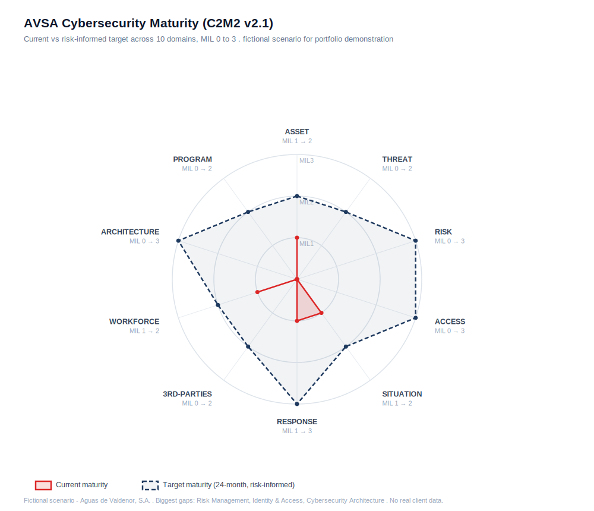

# Maturity Scorecard - AVSA (C2M2 v2.1)

This scorecard rates AVSA's cybersecurity maturity across the ten domains of the **DOE Cybersecurity Capability Maturity Model (C2M2 v2.1)**, on the Maturity Indicator Level (MIL) scale from 0 to 3. Where the Phase 2 [risk assessment](../02-risk-assessment/) asked how AVSA should be architected and where the risk sits, this asks a different question: how mature is AVSA at managing security as an ongoing capability. The two views are complementary, and they point at the same conclusions.

> **Fictional scenario.** All findings concern the fictional operator AVSA and use only public frameworks. No client data is present.

The [gap analysis](gap-analysis.md) and the [remediation roadmap](remediation-roadmap.md) build directly on this scorecard, and the same content is provided as a formatted spreadsheet: [`avsa-maturity-assessment.xlsx`](avsa-maturity-assessment.xlsx).

---

## The MIL scale

C2M2 rates each domain on how institutionalized its practices are, not how sophisticated they are:

| MIL | Meaning |
|:--:|---|
| **MIL0** | The MIL1 practices are not being performed. This is the default, not a claim that nothing exists. |
| **MIL1** | Initial practices are performed, but they are ad hoc and depend on individuals. |
| **MIL2** | Practices are documented, adequately resourced, and involve the right stakeholders. |
| **MIL3** | Practices are governed by policy, reviewed periodically, kept current with the threat environment, and improved. |

A simple practice that is written down, resourced, and reviewed scores higher than an advanced tool that one person runs with no documentation. Maturity is about the management wrapper around the practice.

## Scorecard

Target MILs are **risk-informed**, set to a strategic 24-month end-state. They are not uniformly MIL3: effort is directed to the domains tied to AVSA's biggest risks.

| # | Domain | Current | Target | Gap | Basis for the current score |
|---|---|:--:|:--:|:--:|---|
| 1 | **Asset, Change & Configuration Management** | MIL1 | MIL2 | 1 | An OT asset inventory exists but is a spreadsheet last updated in 2024, and there is no change or configuration management and no automated discovery. Practices happen but are ad hoc. |
| 2 | **Threat & Vulnerability Management** | MIL0 | MIL2 | 2 | There is no structured vulnerability management for OT and no use of threat intelligence. Patching is vendor-locked on some assets and otherwise ad hoc, so the basic MIL1 practices are not reliably performed. |
| 3 | **Risk Management** | MIL0 | MIL3 | 3 | Before this engagement there was no risk management program; risk was treated as part of plant maintenance. Risk management is foundational and is required of an essential entity under NIS2, so it targets MIL3. |
| 4 | **Identity & Access Management** | MIL0 | MIL3 | 3 | Vendor access uses a shared VPN account with no multi-factor authentication, and several remote RTUs retain default credentials. Access is not uniquely attributable, so the MIL1 identity practices are not met. |
| 5 | **Situational Awareness** | MIL1 | MIL2 | 1 | The 24/7 control room provides genuine operational monitoring, which is why this is not MIL0, but there is no security logging, no SIEM, and no security-focused monitoring of the OT environment. |
| 6 | **Event & Incident Response, Continuity of Operations** | MIL1 | MIL3 | 2 | An IT incident response plan exists, but it excludes the plant. There are no OT-specific playbooks, no defined OT incident roles, and no exercises. Response is critical for a water utility, so it targets MIL3. |
| 7 | **Third-Party Risk Management** | MIL0 | MIL2 | 2 | There are no security requirements placed on the SCADA integrator (Nortec) and no review of its access or practices. This domain is examined in detail in the Phase 6 third-party risk assessment. |
| 8 | **Workforce Management** | MIL1 | MIL2 | 1 | Security responsibility sits informally and part-time with the IT manager. There are no dedicated OT security roles and no OT security training, so the practice exists only in a minimal, ad hoc form. |
| 9 | **Cybersecurity Architecture** | MIL0 | MIL3 | 3 | The control network is flat, there is no OT DMZ, and there is no segmentation between the supervisory and operations layers or around external access. This is the central structural finding from Phase 2, so it targets MIL3. |
| 10 | **Cybersecurity Program Management** | MIL0 | MIL2 | 2 | There is no governed OT security program, no sponsorship, and no security strategy. Security is treated as maintenance rather than a managed program. |

## What the scorecard says

AVSA's average current maturity is about **0.4**, which is what you expect from a utility that has treated OT security as an extension of plant maintenance rather than a managed capability. Four domains reach MIL1 rather than MIL0, and they do so for the same underlying reason: the 24/7 control room, an existing (if stale) asset inventory, an existing (if IT-only) incident plan, and nominal security responsibility give AVSA a thin layer of practice in the operations-adjacent domains. Everything else sits at MIL0 because the basic institutionalized practices are not there.

The three largest gaps, each a full three levels, are **Risk Management, Identity and Access Management, and Cybersecurity Architecture**. This is the same message the Phase 2 risk assessment delivered from a different direction: AVSA's exposure is structural, access-related, and governance-related. When an independent maturity view and an independent risk view converge on the same priorities, the priorities are trustworthy. The [remediation roadmap](remediation-roadmap.md) turns those priorities into a sequenced plan.

---

*Fictional scenario. No real client data. Part of the AVSA OT/ICS security assessment case study.*
