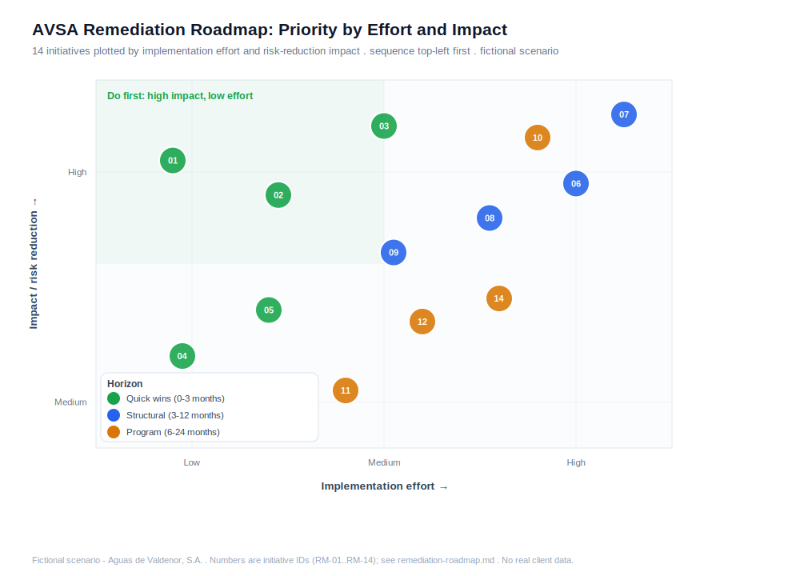

# Remediation Roadmap - AVSA

This roadmap turns the [gap analysis](gap-analysis.md) into a sequenced plan. It is **risk-based**: initiatives are ordered by how much risk they remove for the effort they take, and each one is tied to the specific Phase 2 risks (R-01 to R-14) it addresses and the C2M2 domains it lifts. The aim is a defensible order of work, not a wish list.

> **Fictional scenario.** All findings concern the fictional operator AVSA and use only public frameworks. No client data is present.

---

## Priority view

The chart plots all 14 initiatives by implementation effort and risk-reduction impact. The rule is simple: start in the top-left (high impact, low effort) and work toward the right. The three horizons below follow that logic.

## Sequencing logic

The order is deliberate. **Quick wins go first** because they remove the cheapest and most likely attack paths (default credentials, a shared vendor account with no MFA) in a matter of weeks, and an OT incident response plan immediately improves how AVSA handles everything else. **Structural work goes next** because segmentation and the OT DMZ are the highest-impact changes in the whole plan, but they need design, budget, and maintenance windows, so they cannot be rushed. **Program work runs partly in parallel and lasts longest**, because governance, third-party management, vulnerability management, training, and monitoring are ongoing capabilities rather than one-off fixes. One dependency to note: brokering vendor access through a jump host (RM-08) needs the DMZ from RM-06 to exist first.

## Horizon 1: Quick wins (0 to 3 months)

Low effort, high or medium impact. These reduce risk fast while the larger work is planned.

| ID | Initiative | Effort | Impact | Risks addressed | Domain lift |
|---|---|:--:|:--:|---|---|
| **RM-01** | Remove default credentials on all remote RTUs and set unique per-device credentials | Low | High | R-07 | ACCESS to MIL1 |
| **RM-02** | Replace the shared Nortec VPN account with named identities and MFA; remove standing access | Low-Med | High | R-03 | ACCESS to MIL1-2 |
| **RM-03** | Write and adopt an OT-specific incident response plan; run a first tabletop exercise | Med | High | R-10 | RESPONSE to MIL2 |
| **RM-04** | Introduce a removable-media control policy for OT (allow-listing, scanning, minimize use) | Low | Med | R-08 | THREAT support |
| **RM-05** | Centralize PLC logic and configuration backups off the field laptop; add version control | Low | Med | R-09 | ASSET support |

## Horizon 2: Structural (3 to 12 months)

Higher effort, high impact. This is where the central architecture finding is fixed.

| ID | Initiative | Effort | Impact | Risks addressed | Domain lift |
|---|---|:--:|:--:|---|---|
| **RM-06** | Build a Level 3.5 OT DMZ with a replica historian; end the historian's dual-homing | High | High | R-01, R-13 | ARCHITECTURE toward MIL2 |
| **RM-07** | Segment the flat control LAN into the Phase 2 zones with enforced conduits | High | High | R-12, R-02, R-05 | ARCHITECTURE toward MIL3 |
| **RM-08** | Move the cellular telemetry VPN to land in the DMZ; broker vendor access via an MFA jump host | Med-High | High | R-02, R-03 | ARCHITECTURE, ACCESS to MIL3 |
| **RM-09** | Isolate the chlorine dosing zone (Z6) behind an enforced conduit; add setpoint-change monitoring | Med | High | R-04, R-14 | ARCHITECTURE, SITUATION |

## Horizon 3: Program (6 to 24 months)

Sustained capability building. These run partly alongside Horizon 2 and continue longest.

| ID | Initiative | Effort | Impact | Risks addressed | Domain lift |
|---|---|:--:|:--:|---|---|
| **RM-10** | Stand up a governed OT security program: sponsorship, scope, roles, policy set, recurring risk cycle | High | High | Foundational (all) | PROGRAM to MIL2, RISK to MIL2-3 |
| **RM-11** | Formalize third-party risk management for Nortec and future suppliers (contract terms, questionnaire, review) | Med | Med | R-03 (governance) | THIRD-PARTIES to MIL2 |
| **RM-12** | Establish OT vulnerability management; apply compensating controls for the Windows 7 HMIs pending replacement | Med | Med | R-05 | THREAT to MIL2 |
| **RM-13** | Define OT security roles and deliver role-based OT security training | Med | Med | Workforce capability | WORKFORCE to MIL2 |
| **RM-14** | Deploy OT security logging and monitoring with a basic set of detection use cases | Med-High | Med | Detection across all | SITUATION to MIL2 |

## Expected maturity trajectory

The gaps close in step with the horizons:

- **After Horizon 1 (about 3 months):** Identity and Access moves off MIL0, Incident Response reaches MIL2, and the residual likelihood of R-03, R-07, R-08, R-09, and R-10 drops. Cheap, fast, visible progress.
- **After Horizon 2 (about 12 months):** Cybersecurity Architecture moves from MIL0 to MIL2 or MIL3, and the structural risks (R-01, R-02, R-04, R-12, R-13, R-14) fall materially as the flat network is segmented and the IT/OT boundary is built. Access reaches MIL3 once vendor access is brokered through the DMZ.
- **After Horizon 3 (about 24 months):** Risk, Program, Third-Parties, Threat, Workforce, and Situational Awareness reach their MIL2 targets, and Risk reaches MIL3. At this point AVSA meets the target profile set in the [scorecard](maturity-scorecard.md), and just as importantly it has the governed program (RM-10) that keeps the other domains from sliding back.

The single most important sequencing point for an interview: **structure before hardening**. Building the boundary and segmenting the network (Horizon 2) removes whole attack paths at once, which is why it outranks patching individual assets. The quick wins come first only because they are nearly free and buy time while that structural work is designed and funded.

---

*Fictional scenario. No real client data. Part of the AVSA OT/ICS security assessment case study.*
