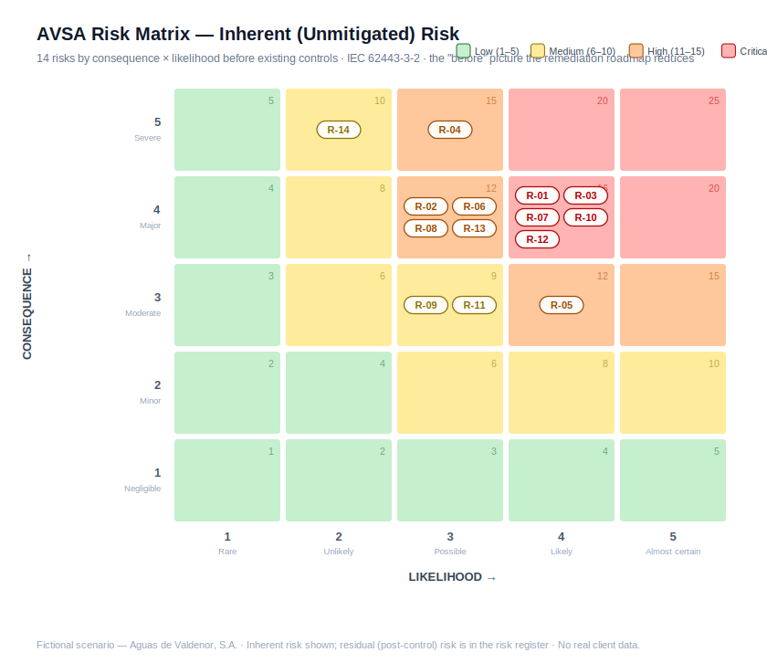

# OT/ICS Security Assessment: A 62443 & NIS2 Case Study

A paper-based OT security assessment of a **fictional** mid-sized water utility, produced end to end against public frameworks (IEC 62443, NIST SP 800-82r3, C2M2, and MITRE ATT&CK for ICS). It covers a reference architecture, a zone and conduit risk assessment, a maturity gap analysis, a remediation roadmap, governance policies, a third-party risk review, and NIS2/ENS regulatory mapping.

> **⚠️ Fictional scenario.** This project assesses a **fictional organization** (Aguas de Valdenor, S.A.) and uses only **public frameworks and standards**. It contains no client data, no proprietary material, and no confidential work artifacts. It reproduces an OT security assessment capability for portfolio purposes.

---

## Why I built this

<!-- Matthew: this is a default paragraph. If you already customized this in your repo, paste your version back here before committing. -->

At EY I support OT security engagements (maturity assessments, IEC 62443-aligned governance, control mapping, and third-party risk) that I cannot share publicly. My client OT work was in a different sector and region. To show the capability without touching any client material, I reproduced a complete OT security assessment for a fictional EU water utility, which also maps to the NIS2 and ENS environment I am targeting for remote roles.

## The fictional client

**Aguas de Valdenor, S.A. (AVSA)** is a municipally owned drinking-water utility in northern Spain serving about 152,000 residents from the ETAP Río Almora treatment plant (72,000 m³/day design capacity) and a distribution network of 9 pumping stations and 4 reservoirs. A November 2025 ransomware incident on the corporate network, which stopped one hop short of the plant, triggered this assessment. Full scenario: [`00-client-brief/`](00-client-brief/fictional-company-profile.md).

## What this demonstrates

OT/ICS security architecture review (Purdue model), IEC 62443-3-2 zone-and-conduit risk assessment, security-level (SL-T) targeting, C2M2 maturity assessment, risk-based remediation planning, OT governance drafting aligned to IEC 62443-2-1 and ISO/IEC 27001, MITRE ATT&CK for ICS threat mapping, third-party and supply-chain risk assessment, and EU regulatory analysis (NIS2, ENS).

`ot-security` `iec-62443` `ics` `scada` `purdue-model` `nist-800-82` `c2m2` `nis2` `ens` `risk-assessment` `grc` `mitre-attack-ics` `tprm`

## The assessment, walked through

| # | Deliverable | Status |
|---|---|---|
| 1 | [Client brief & scenario](00-client-brief/fictional-company-profile.md) | ✅ |
| 2 | [Reference architecture (Purdue, current state)](01-architecture/reference-architecture.md) | ✅ |
| 3 | [Risk assessment: IEC 62443-3-2 zones, conduits, SL-T](02-risk-assessment/) | ✅ |
| 4 | [Maturity assessment, gap analysis & remediation roadmap (C2M2)](03-maturity-assessment/) | ✅ |
| 5 | Governance pack: OT security policy, asset inventory, ISMS scope | 🔜 |
| 6 | MITRE ATT&CK for ICS mapping | 🔜 |
| 7 | Third-party risk: vendor questionnaire & risk memo | 🔜 |
| 8 | NIS2 & ENS obligations mapping | 🔜 |

### 1 · Scope and scenario

AVSA's plant control system (five process areas, 24 PLCs) plus its distribution telemetry (13 remote RTU/PLC units) form the System under Consideration. The wastewater facility and corporate IT are explicitly excluded. The scenario is built around a question every utility board is asking after the recent attacks on water systems: if the office network falls, does the plant fall with it?

### 2 · Reference architecture, current state

The architecture review maps AVSA to the Purdue model and surfaces five architectural observations, headlined by a **missing OT DMZ and a dual-homed historian** that together give a corporate compromise an unbrokered path into the control network. Full analysis: [`01-architecture/reference-architecture.md`](01-architecture/reference-architecture.md).

### 3 · Risk assessment (IEC 62443-3-2)

The System under Consideration is partitioned into seven zones and seven conduits, each with a target security level (SL-T) driven by consequence. Fourteen risks are then scored on a documented 5x5 rubric, with inherent and residual ratings and a matching MITRE ATT&CK for ICS technique for each.

Five risks come out inherently Critical, and they cluster in one place: the missing IT/OT boundary, the flat control network, uncontrolled vendor remote access, and the lack of an OT incident response plan. The headline finding is that AVSA's dominant exposure is structural rather than a list of weak individual assets, so the remediation priority is to build the boundary and segment the network before hardening endpoints.

- [Methodology](02-risk-assessment/methodology-62443-3-2.md): the 62443-3-2 workflow, the scoring rubric, and how SL-T is derived.
- [Zone & conduit register](02-risk-assessment/zone-conduit-register.md): the target zone model with SL-T, current SL-A, and the gap.
- [Risk register](02-risk-assessment/risk-register.md): all 14 risks scored, with the top ones written up in detail.
- [Risk assessment workbook](02-risk-assessment/avsa-risk-assessment.xlsx): the same content as a formatted, filterable spreadsheet.

### 4 · Maturity assessment and remediation roadmap (C2M2)

AVSA is scored across the ten C2M2 domains on the MIL 0 to 3 scale, with risk-informed targets. The current profile averages about 0.4, which is typical of a utility that has treated OT security as plant maintenance.

The three largest gaps (Risk Management, Identity and Access, and Cybersecurity Architecture) line up with the Phase 2 risk findings, which is the point: an independent maturity view and an independent risk view converge on the same priorities. The roadmap turns those priorities into 14 sequenced initiatives across three horizons, each tied to the risks it closes, on the principle of structure before hardening: build the boundary and segment the network before patching individual assets.

- [Maturity scorecard](03-maturity-assessment/maturity-scorecard.md): all 10 domains scored, with the radar and per-domain rationale.
- [Gap analysis](03-maturity-assessment/gap-analysis.md): what is missing to close each gap.
- [Remediation roadmap](03-maturity-assessment/remediation-roadmap.md): 14 initiatives, sequenced by effort and impact.
- [Maturity workbook](03-maturity-assessment/avsa-maturity-assessment.xlsx): scorecard, gap analysis, and roadmap as a spreadsheet.

### 5 to 8 · planned

See the table above. These build on the assessment so far: the governance pack, the MITRE ATT&CK for ICS mapping, the third-party risk assessment of the SCADA integrator, and the NIS2/ENS regulatory mapping.

## Frameworks & references

IEC 62443-3-2 / -2-1 / -3-3 · NIST SP 800-82r3 · DOE C2M2 v2.1 · MITRE ATT&CK for ICS · NIS2 Directive (EU 2022/2555) · CER Directive (EU 2022/2557) · Esquema Nacional de Seguridad (Spain) · CISA water-sector guidance

## About

Built by **Matthew**, cybersecurity consultant (OT security governance and assessments), PNPT-certified, currently pursuing CPTS and BSCP.

<!-- Matthew: paste your real links here if you have not already. -->
[LinkedIn](#) · [GitHub profile](#) · [Credly](#)

---

*Fictional scenario. No real client data. See disclaimer above.*
