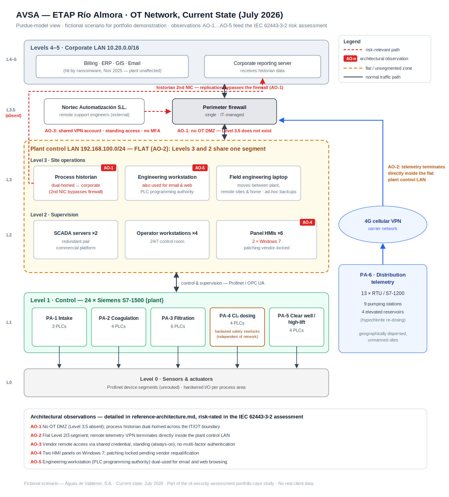

# OT/ICS Security Assessment — A 62443 & NIS2 Case Study

A lab/paper-based OT security assessment of a **fictional** mid-sized water utility, produced end-to-end against public frameworks — IEC 62443, NIST SP 800-82r3, C2M2, and MITRE ATT&CK for ICS: reference architecture, zone/conduit risk assessment, maturity gap analysis, remediation roadmap, governance policies, third-party risk review, and NIS2/ENS regulatory mapping.

> **⚠️ Fictional scenario.** This project assesses a **fictional organization** (Aguas de Valdenor, S.A.) and uses only **public frameworks and standards**. It contains no client data, no proprietary material, and no confidential work artifacts. It reproduces an OT security assessment *capability* for portfolio purposes.

---

## Why I built this

At my current job, I have supported OT security and maturity assessments, IEC 62443-aligned governance, control mapping, and third-party risk on client engagements I can't disclose. So, rather than sanitizing client material, I rebuilt this capability from scratch for a fictional industrial operator. This proves independent capability as it has zero disclosure risk. I chose an EU water utility deliberately: different sector and region from my client work, and it maps to the NIS2/ENS regulatory environment I am targeting. 

## The fictional client

**Aguas de Valdenor, S.A. (AVSA)** — a municipally owned drinking-water utility in northern Spain serving ~152,000 residents from the ETAP Río Almora treatment plant (72,000 m³/day design capacity) and a distribution network of 9 pumping stations and 4 reservoirs. A November 2025 ransomware incident on the corporate network — which stopped one hop short of the plant — triggered this assessment. Full scenario: [`00-client-brief/`](00-client-brief/fictional-company-profile.md).

## What this demonstrates

OT/ICS security architecture review (Purdue model), IEC 62443-3-2 zone-and-conduit risk assessment, security-level (SL-T) targeting, C2M2 maturity assessment, risk-based remediation planning, OT governance drafting aligned to IEC 62443-2-1 and ISO/IEC 27001, MITRE ATT&CK for ICS threat mapping, third-party/supply-chain risk assessment, and EU regulatory analysis (NIS2, ENS).

`ot-security` `iec-62443` `ics` `scada` `purdue-model` `nist-800-82` `c2m2` `nis2` `ens` `risk-assessment` `grc` `mitre-attack-ics` `tprm`

## The assessment, walked through

| # | Deliverable | Status |
|---|---|---|
| 1 | [Client brief & scenario](00-client-brief/fictional-company-profile.md) | ✅ |
| 2 | [Reference architecture (Purdue, current state)](01-architecture/reference-architecture.md) | ✅ |
| 3 | Risk assessment — IEC 62443-3-2 zones, conduits, SL-T | 🔜 |
| 4 | Maturity assessment, gap analysis & remediation roadmap (C2M2) | 🔜 |
| 5 | Governance pack — OT security policy, asset inventory, ISMS scope | 🔜 |
| 6 | MITRE ATT&CK for ICS mapping | 🔜 |
| 7 | Third-party risk — vendor questionnaire & risk memo | 🔜 |
| 8 | NIS2 & ENS obligations mapping | 🔜 |

### 1 · Scope and scenario

AVSA's plant control system (five process areas, 24 PLCs) plus its distribution telemetry (13 remote RTU/PLC units) form the System under Consideration; the wastewater facility and corporate IT are explicitly excluded. The scenario is built around a question every utility board is asking after the recent wave of attacks on water systems: *if our office network falls, does the plant fall with it?*

### 2 · Reference architecture — current state

The architecture review maps AVSA to the Purdue model and surfaces five architectural observations — headlined by a **missing OT DMZ and a dual-homed historian** that together give a corporate compromise an unbrokered path into the control network. Full analysis: [`01-architecture/reference-architecture.md`](01-architecture/reference-architecture.md).

### 3 · Risk assessment *(in progress)*

Zone/conduit partitioning per IEC 62443-3-2, consequence-driven threat analysis, and target security levels (SL-T) per zone.

### 4–8 · *(planned — see table above)*

## Frameworks & references

IEC 62443-3-2 / -2-1 / -3-3 · NIST SP 800-82r3 · DOE C2M2 v2.1 · MITRE ATT&CK for ICS · NIS2 Directive (EU 2022/2555) · CER Directive (EU 2022/2557) · Esquema Nacional de Seguridad (Spain) · CISA water-sector guidance

## About

Built by **Matthew G. Caballero** — cybersecurity consultant (OT security governance & assessments), PNPT-certified, currently pursuing CPTS and BSCP.

[LinkedIn](https://www.linkedin.com/in/matthewgcaballero/) · [GitHub profile](https://github.com/mattcaballero11) · [Credly](https://www.credly.com/users/matthew-caballero.9d29c5b1)

---

*Fictional scenario — no real client data. See disclaimer above.*
